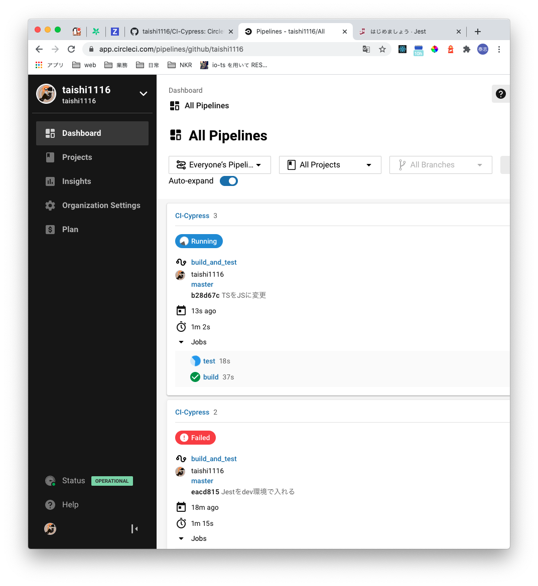

## 背景

私の携わっている開発ではCircleCIが導入されているのですが、参画当時の私は知見が0でした。
これを機に勉強し、Outputとして記事に残しています。


## CircleCIとは

SaaS型のCI/CDツールです。

他のCI/CDツールと異なる点は`SaaS`であるところです。   
この特徴からサーバーを導入する必要がなく、すぐに    導入できる点が特徴です。

他にもJenkinsなどが有名ですが、こちらだとサーバーなどの環境構築が必要です。


## 基本コンポーネントについて

CircleCIには`Workflow`、`Jobs`、`Step`という3つの概念があります。   
下記に詳細を示します。

### Step

CicleCIで実行する各コマンドのことを`Step`といいます。  
単体テストの実行や、ビルド、デプロイ作業などがこれにあたります。


### Job

`Job`は`Step`の集まりになります。   
簡単に述べると先ほど説明した`Step`を機能単位にまとめたものと言った感じです。  
内容は主に下記を定義します。

* ジョブの名前
* 利用するDocker Image(ジョブを実行する環境)
* `Step`一覧

各ジョブに対して専用のコンテナ環境を用意することができ、その中で定義したステップが順次実行されていきます。
ジョブごとにコンテナ環境の指定を行うので、ジョブとジョブは分離されて動きます。  
よって逐次実行のみならず、並列実行も可能です。


### WorkFlow

最後に`WorkFlow`です。
こちらは先ほどの`Job`をどのように実行し制御するかを記述します。

* 依存関係のインストールを一番最初に実施したい
* その後に単体テストを走らせたい

このようにワークフローを制御することが可能です。


### 簡単にまとめると
* 小さな実行コマンド達を`Step`という
* `Step`を一つの機能にまとめた物を`Job`という
* 作った`Job`をどのような順番に実行していくか制御するのが`WorkFlow`


## CircleCIで単体テストを回してみる

先ほどまでは概念をまとめました。
言葉だけだとイメージがつかないので、フロントで単体テストを実行する環境を作っていきます。


### 環境構築
まずは環境構築です。
皆さんのお好きな環境を構築してください。

* React or Vueの準備
* Jestのinstall
* GitHubに勉強用リポジトリを作る
* CircleCIのサイトでアカウントを作り、ログイン(GitHubアカウントで行けたはず)


### テストコードの追加
それではテストコードを実装していきましょう。  
お好きなディレクトリに下記テストコードを実装してみていください。  
今回はCircleCIの勉強なのでチープなテストコードですがご了承を。


```ts
test('CIで単体テストを回す', () => {})
```

#### テストコード結果
```sh
yarn run v1.22.10
$ /Users/shinodataishi/GitHub/ci-cypress/node_modules/.bin/jest
 PASS  src/test/index.test.ts
  ✓ CIで単体テストを回す (1 ms)

Test Suites: 1 passed, 1 total
Tests:       1 passed, 1 total
Snapshots:   0 total
Time:        1.18 s
Ran all test suites.
✨  Done in 2.41s.
```

正常に動いていること確認できました。ではこれをCircleCIで回してみましょう。


#### CircleCIの設定ファイル追加

CircleCIの実装をしていきます。  
設定ファイルはプロジェクトルートディレクトリに`.circleci/config.yml`という形で記述していきます。

先頭にCircleCIのバージョンを記述。
その後には先ほど説明した`Jobs`、`WorkFlow`の順に記述していきます。

まず先に必要な機能(Jobs)を作ってから手順(WorkFlow)に落とし込む感じですね。  
各行が何をしているのかコメントしているので、そちらを参考にしてみてください。

注意すべきなのがインデントの数です。
`step`の中の`run`はインデントが2つになります。  
このインデント数でエラーになるのはCIあるあるなので気をつけましょう。


```yml
# CircleCIのバージョンを指定
version: 2.1
# stepsを1つの機能にまとめるJobを定義
jobs:
  # buildというjobを定義
  build:
    # buildを実行するdocker環境を指定
    docker:
      - image: circleci/node:12
    # buildというjobが実行するstepsを定義
    steps:
      - checkout
      - run:
          command: yarn install
      - run:
          command: yarn build
  test:
    docker:
      - image: circleci/node:12
    steps:
      - checkout
      - run:
          name: install dependencies
          command: yarn install
      - run:
          name: unit test
          command: yarn test
# 定義したjobsをどのように実行していくか記述する(今回は並行処理としている)
workflows:
  version: 2
  build_test:
    jobs:
      - build
      - test

```

### CircleCIが動いているか確認する

では実際にCircleCIが`config.yml`通りの動きをしているかチェックしましょう。
いつもの手順でこれまでの変更をmasterリポジトリにpushしてください。
その後、CircleCIのアプリページを確認します。



下記のように定義した`Job`が実行されているとOKです。


### config.ymlを改良する

これで最低限の実装は完了しましたが、構成が大きくなり記述量が増えると可読性が低くなります。  
そこで何度も使用する環境や処理は`executors`と`commands`を用いて予め定義することができます。  
予め変数に代入しておくようなイメージです。
`executors`は環境の定義、`commands`は`step`の定義をすることが可能です。

以下は`executors`で`node.js`の環境を定義、`commands`で`依存関係の処理をキャッシュする処理を記述しています。


```yml
version: 2.1
# executorsで何度も指定する実行環境を予め定義する
executors:
  node:
    docker:
      - image: circleci/node:12
# commandsで何度も使用するstepを定義する
commands:
  # 依存関係のキャッシュを利用する処理
  restore_node_modules:
    steps:
      - restore_cache:
          key: dependency-cache-{{ checksum "yarn.lock" }}
  # 依存関係をCircleCIのキャッシュに保存する処理
  save_node_modules:
    steps:
      - save_cache:
          key: dependency-cache-{{ checksum "yarn.lock" }}
          paths:
            - ./node_modules

jobs:
  build:
    # executorから環境を参照する
    executor: node
    steps:
      - checkout
      # commandsで定義した処理を利用
      - restore_node_modules
      - run:
          command: yarn install
      - run:
          command: yarn build
      # commandsで定義した処理を利用
      - save_node_modules
  test:
    # executorから環境を参照する
    executor: node
    steps:
      - checkout
      # commandsで定義した処理を利用
      - restore_node_modules
      - run:
          name: install dependencies
          command: yarn install
      - run:
          name: unit test
          command: yarn test
workflows:
  version: 2
  build_and_test:
    jobs:
      - build
      - test

```

これでCircleCIの概念を掴むことができました。  
次はCircleCIを利用した結合テストの自動化について学びたいと思います。